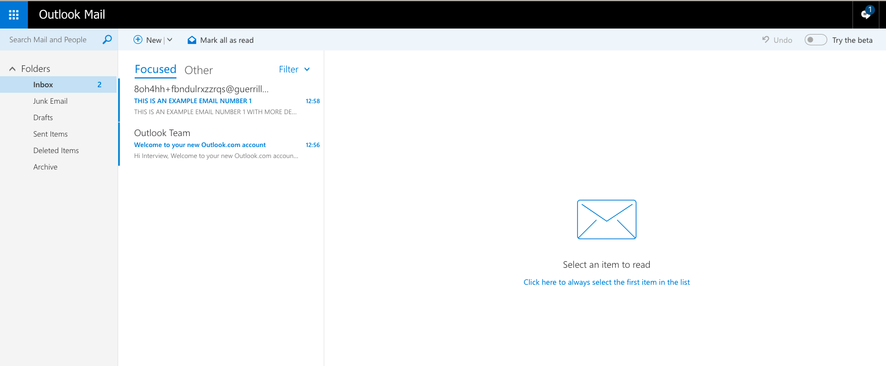

## Interview Assignment

<hr>

### E-mail Client

The goal of this assignment is to build a prototype email client.



To see an example: Login to https://outlook.live.com/.

The following pages have more details. Please read through the entire document for all the details.

<hr>

### Features

1. The email client can have multiple mail folders
2. We assume the following mail folders to be present
   1. Inbox
   2. Spam
   3. Deleted Items
   4. Custom Folder
3. The **starting data** of this application can be assumed to come from a JSON file
4. As an example, 2 JSON file has been given to you. **You can create rest of the json yourself.**
   1. inbox.json
   2. spam.json
5. Each of the element in the JSON file represents a mail
   1. **subject**: The mail subject which is a string
   2. **content**: The mail content which is a string and can contain html.
   3. **mId**: The mail Id of this mail which can be assumed to be unique Guid string
   4. **unread**: boolean
6. The client should have the following features
   1. When the app starts, the app loads the contents of each folder and displays the unread counts.
   2. User can move around within the app to Inbox, Spam and Custom Folder
   3. User can select any mail and look into the contents
   4. User can see a brief preview before clicking on it.
   5. User can delete a message. In which case it should come in deleted items
   6. User can flag a message.
   7. User can filter on inbox on whether a message is flagged or not.
   8. State, navigation should be saved between refreshes
   9. Back button should work.
7. **fork** current problem repository. and make your forked repository **private**.
8. Add `@bhar4t`, `@divich` as collaborator while intializing repository in github. and follow the given timeline instructions from your mail.

<hr>

### Coding Guidelines

- For design ideas and functionality: Please look at https://outlook.live.com/
- Please avoid any frameworks and libraries except react and mobx.
- Focus more on the JavaScript side of the problem.
- You will be evaluated on
  - UI & design
  - Modularity of Code
  - Data Structures used
  - Logic and cleanliness of code.
  - Completeness.

<hr>

> inbox.json

```json
[
  {
    "mId": "guid-1",
    "unread": true,
    "subject": "Training Program",
    "content": "About Microsoft Virtual Academy<br/>Microsoft Virtual Academy provides free online training by world-class experts to help you build your technical skills and advance your career. Make it your destination of choice to get started on the latest Microsoft technologies and join this vibrant community."
  },
  {
    "mId": "guid-2",
    "unread": false,
    "subject": "Empower your future",
    "content": "We foster our pipeline of future leaders with 47 employee networks and 7 global employee resource groups, servicing an active community of thousands across Microsoft"
  }
]
```

> spam.json

```json
[
  {
    "mId": "guid-3",
    "unread": true,
    "subject": "Pre Approved Loan",
    "content": "Congratulations ! <u>Credit card<u> is being shipped to you today!"
  },
  {
    "mId": "guid-4",
    "unread": true,
    "subject": "You won a lottery!",
    "content": "You have just won the New York official lottery. Please send us your address so that we may start the transfer."
  }
]
```
